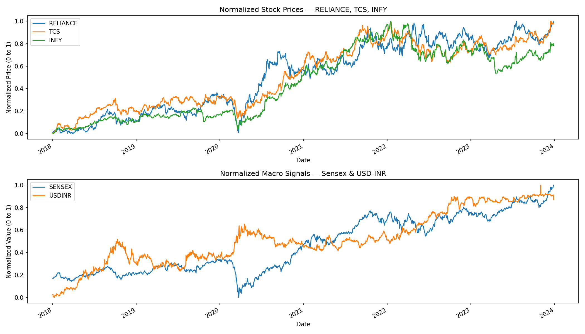
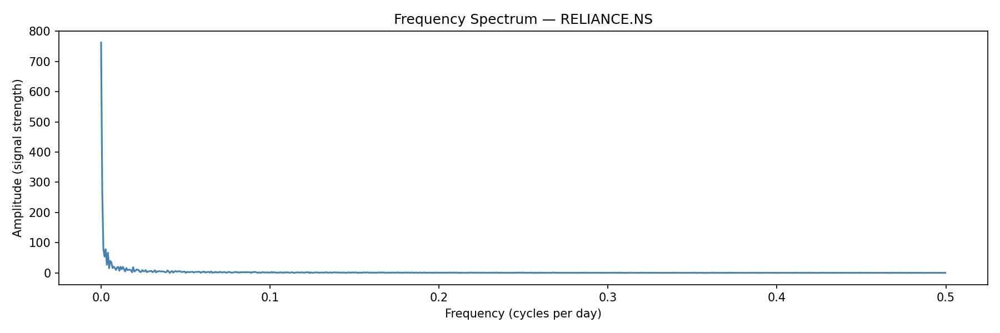
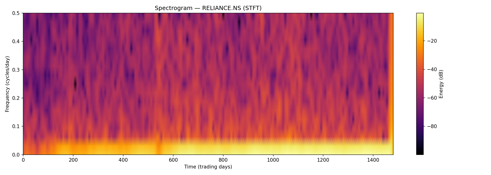
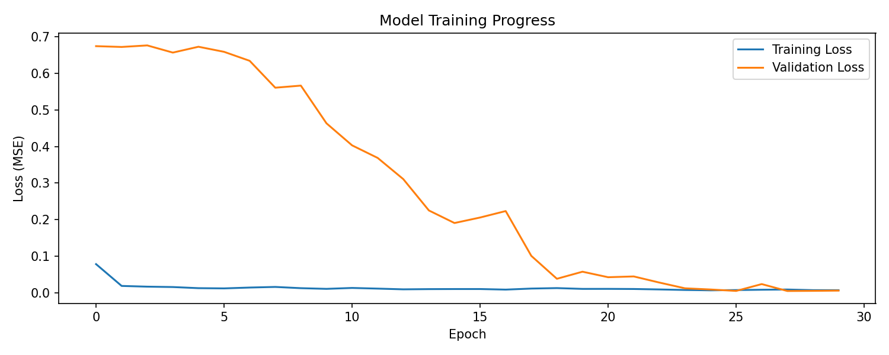
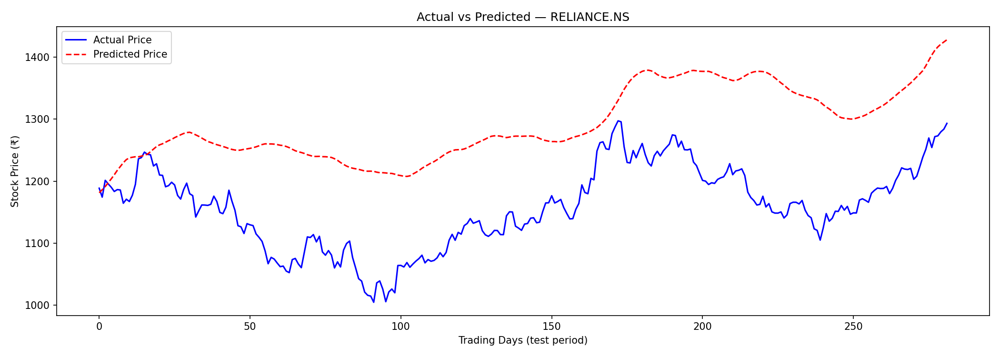
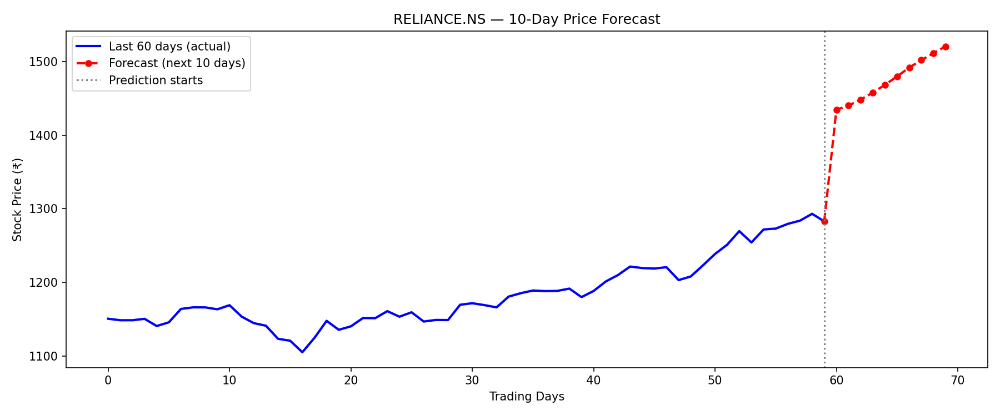
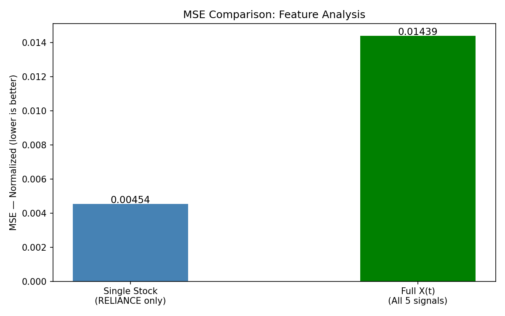

# Pattern Recognition for Financial Time Series Forecasting

---

## Student Information

| Field | Details |
|---|---|
| **Name** | Joseph John Paul |
| **University Registration No.** | KTE24CS077 |
| **Admission No.** | 24B1221 |

---

## Project Description

This project implements a complete pipeline for **stock price prediction** using time-frequency signal processing and deep learning. Financial time series data is treated as a multivariate signal:

```
X(t) = [p(t), r(t), g(t), s(t), d(t)]
```

Where:
- `p(t)` — Stock price (RELIANCE, TCS, INFY)
- `s(t)` — Market index (Sensex)
- `d(t)` — USD-INR exchange rate

The core idea is to convert stock price data into **spectrogram images** using the Short-Time Fourier Transform (STFT), and then train a **Convolutional Neural Network (CNN)** to recognize patterns in those images and predict future prices.

### Pipeline

```
Raw Stock Data → Normalize → STFT Spectrogram → CNN Model → Price Prediction
```

---

## Requirements

Install all dependencies with:

```bash
pip install yfinance numpy pandas matplotlib scipy tensorflow scikit-learn
```

| Library | Purpose |
|---|---|
| `yfinance` | Download stock data from Yahoo Finance |
| `numpy` | Numerical computation |
| `pandas` | Data manipulation |
| `matplotlib` | Plotting and visualization |
| `scipy` | STFT signal processing |
| `tensorflow` | CNN model building and training |
| `scikit-learn` | Normalization and evaluation metrics |

---

## How to Run

**Step 1 — Clone or download the project files**

Make sure the following file is in your project folder:
```
stock_prediction.py
```

**Step 2 — Open terminal in the project folder**

In VSCode press `` Ctrl + ` `` to open the terminal, then navigate to your folder:

```bash
cd path/to/your/project/folder
```

**Step 3 — Install dependencies**

```bash
python -m pip install yfinance numpy pandas matplotlib scipy tensorflow scikit-learn
```

> Use `python -m pip` instead of just `pip` to ensure packages install into the same Python that VSCode is using.

**Step 4 — Run the program**

```bash
python stock_prediction.py
```

> ⚠️ Do NOT use the Code Runner play button (▶️) in VSCode — it only runs selected text. Always run from the terminal.

**Step 5 — Wait for completion**

The program will run all 4 chapters automatically and print progress to the terminal. Total runtime is approximately **10–20 minutes** depending on your machine (training takes the longest).

---

## Configuration

You can customize the following settings at the top of `stock_prediction.py`:

```python
TICKERS       = ["RELIANCE.NS", "TCS.NS", "INFY.NS"]  # stocks to use
START_DATE    = "2018-01-01"   # data start date
END_DATE      = "2023-12-31"   # data end date
WINDOW_SIZE   = 64             # days per training sample
NPERSEG       = 32             # STFT window length
NOVERLAP      = 24             # STFT overlap
EPOCHS        = 30             # max training epochs
BATCH_SIZE    = 32             # samples per training step
FORECAST_DAYS = 10             # how many days ahead to predict
```

---

## Output Files

After running, the following files are saved automatically:

| File | Description |
|---|---|
| `figure1_time_series.png` | Normalized stock prices over time |
| `figure2_frequency_spectrum.png` | Frequency spectrum (FFT) of RELIANCE |
| `figure3_spectrogram.png` | STFT Spectrogram of RELIANCE |
| `training_progress.png` | Training vs validation loss per epoch |
| `prediction_plot.png` | Actual vs predicted prices on test data |
| `future_forecast.png` | Next 10 days price forecast |
| `feature_comparison.png` | MSE comparison: single stock vs full X(t) |

---

## Results

### Figure 1 — Normalized Stock Prices (Time Series)

Shows RELIANCE, TCS, INFY stock prices and macro signals (Sensex, USD-INR) normalized to [0,1] over 2018–2024. The sharp dip around early 2020 corresponds to the COVID-19 market crash.



---

### Figure 2 — Frequency Spectrum

FFT of RELIANCE stock price showing frequency content of the entire signal. The dominant spike near frequency 0 confirms that long-term trend is the strongest pattern in the data.



---

### Figure 3 — Spectrogram (STFT)

2D time-frequency representation of RELIANCE stock price. The bright yellow band at the bottom represents the strong long-term trend. Vertical streaks in the middle correspond to periods of medium-term volatility.



---

### Figure 4 — Model Training Progress

Training loss (blue) converged quickly while validation loss (orange) gradually decreased over 30 epochs. Both converged near zero by epoch 29, indicating the model learned generalizable patterns.



---

### Figure 5 — Actual vs Predicted Prices

The CNN model's predictions (red dashed) track the general trend of actual RELIANCE prices (blue) on unseen test data. The predicted line is smoother than actual prices — expected behaviour since spectrograms capture frequency trends rather than daily noise.



---

### Figure 6 — 10-Day Future Forecast

Recursive forecast for the next 10 trading days beyond the dataset. The model predicts an upward trend from the last known price of ~₹1290. Note: accuracy decreases with each additional day as errors compound.



---

### Figure 7 — Feature Comparison (MSE Analysis)

Comparison of two approaches:
- **Single stock** (RELIANCE price only): MSE = 0.00454
- **Full X(t)** (all 5 signals as separate channels): MSE = 0.01439

The single stock model outperformed the multivariate model. This suggests that for short-term price prediction, the stock's own price history contains more predictive information than macro signals when using this architecture. Future work could explore better feature fusion methods.



---

## References

1. Y. Zhang and C. Aggarwal, "Stock Market Prediction Using Deep Learning," IEEE Access.
2. A. Tsantekidis et al., "Deep Learning for Financial Time Series Forecasting."
3. S. Hochreiter and J. Schmidhuber, "Long Short-Term Memory," Neural Computation, 1997.
4. A. Borovykh et al., "Conditional Time Series Forecasting with CNNs."
